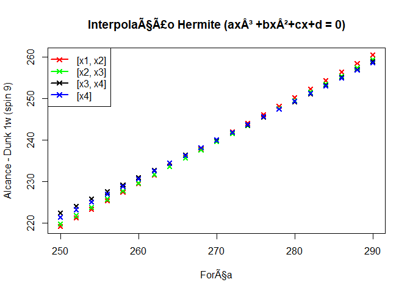
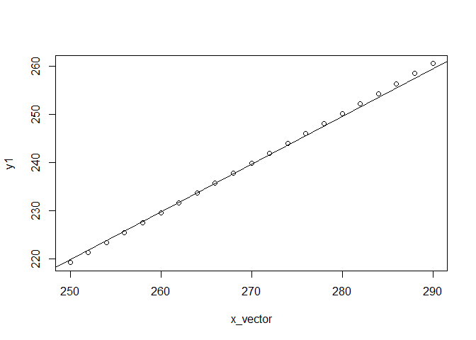
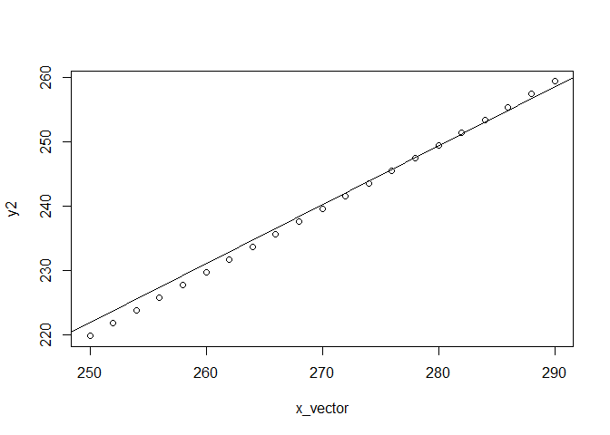
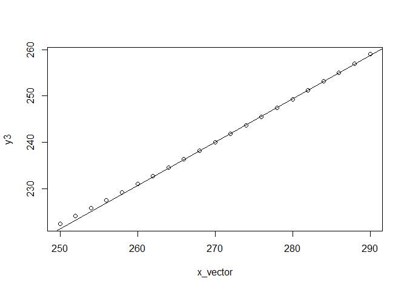
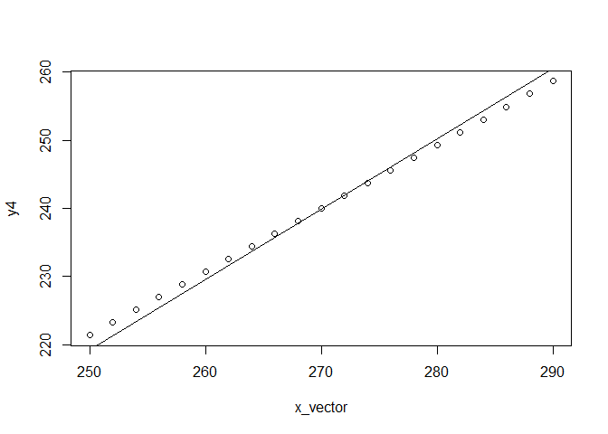

## 1. Descrição do problema
# Este projeto está em constante implementação e está sendo utilizado como backup. Por favor, aguarde liberação deste relatório na sua versão final para breve.
PangYa é um jogo de golfe online produzido pela Ntreev Soft, em 2004.

Em um jogo de golfe, o objetivo principal é acertar o buraco com o menor número possível de tacadas.

Em PangYa, podemos realizar cálculos para ter maior acurácia nas tacadas.

Desde que se começou a realizar os primeiros cálculos em PangYa, se identificou que uma das maiores dificuldades está em determinar, com exatidão, os valores relacionados às "influências" das tacadas. Para que possamos entrar no assunto, deixe-me mostrar a seguinte imagem para você entender melhor sobre o que estou falando.

***********TODO: imagem PangYa buraco 1 BL tee show.
Figura 1: uma captura in-game de PangYa

Repare, na figura 1, que o PangYa possui os seguintes elementos de jogo:

1. Barra de força:
2. Spin:
3. Altura:
4. Vento:
5. TODO...

O problema, portanto, é: dados os elementos de jogo, como podemos calcular uma jogada em PangYa com maior acurácia possível?

Podemos calcular a jogada de acordo com conceitos da Física ou mesmo da Matemática. Farei uma análise aqui utilizando a segunda disciplina mencionada.

## 2. Análise de uma jogada
TODO...


```r
x1 <- 250
x4 <- 290
x2 <- (x4 + x1) / 2
x3 <- x1+(x2-x1)+(x4-x2)/2
x <- c(x1, x2, x3, x4)
x
```

```
## [1] 250 270 280 290
```

```r
y <-c(219.24, 239.60, 249.29, 258.67)
y
```

```
## [1] 219.24 239.60 249.29 258.67
```

```r
interpolation_size <- 21 # 21 forças

z <- spline(x, y, n=21)
z
```

```
## $x
##  [1] 250 252 254 256 258 260 262 264 266 268 270 272 274 276 278 280 282
## [18] 284 286 288 290
## 
## $y
##  [1] 219.2400 221.3369 223.4200 225.4894 227.5452 229.5875 231.6164
##  [8] 233.6320 235.6344 237.6237 239.6000 241.5634 243.5140 245.4519
## [15] 247.3772 249.2900 251.1904 253.0785 254.9544 256.8182 258.6700
```

```r
power_dataframe <- do.call(rbind.data.frame, z)
for (index in 1:length(power_dataframe)) {
        colnames(power_dataframe)[index] <- paste("Power/Reach ", index)
}

power_dataframe
```

```
##   Power/Reach  1 Power/Reach  2 Power/Reach  3 Power/Reach  4
## 1         250.00       252.0000         254.00       256.0000
## 2         219.24       221.3369         223.42       225.4894
##   Power/Reach  5 Power/Reach  6 Power/Reach  7 Power/Reach  8
## 1       258.0000       260.0000       262.0000        264.000
## 2       227.5452       229.5875       231.6164        233.632
##   Power/Reach  9 Power/Reach  10 Power/Reach  11 Power/Reach  12
## 1       266.0000        268.0000           270.0        272.0000
## 2       235.6344        237.6237           239.6        241.5634
##   Power/Reach  13 Power/Reach  14 Power/Reach  15 Power/Reach  16
## 1         274.000        276.0000        278.0000          280.00
## 2         243.514        245.4519        247.3772          249.29
##   Power/Reach  17 Power/Reach  18 Power/Reach  19 Power/Reach  20
## 1        282.0000        284.0000        286.0000        288.0000
## 2        251.1904        253.0785        254.9544        256.8182
##   Power/Reach  21
## 1          290.00
## 2          258.67
```

```r
splines::interpSpline(x,y)$coef
```

```
##        [,1]      [,2]         [,3]          [,4]
## [1,] 219.24 1.0323478  0.000000000 -3.586957e-05
## [2,] 239.60 0.9893043 -0.002152174  1.217391e-05
## [3,] 249.29 0.9499130 -0.001786957  5.956522e-05
## [4,] 258.67 0.9320435  0.000000000  0.000000e+00
```

```r
print("ax³ + bx² + cx + d = 0")
```

```
## [1] "ax³ + bx² + cx + d = 0"
```

```r
x_vector <- seq(from=250, to=290, by=2)
y1 <- 219.24 + 1.0323478 * (x_vector-250)
y2 <- 239.6 + 0.9893043 * (x_vector-270)
y3 <- 249.29 + 0.9499130 * (x_vector-280) + 0.001786957 * (x_vector - 280)^2
y4 <- 258.67 + 0.9320435 * (x_vector-290)

plot(x_vector,y1,type="p", col="red", lwd=2, pch=4, main="Interpolação Hermite (ax³ +bx²+cx+d = 0)", xlab="Força", ylab="Alcance - Dunk 1w (spin 9)")
abline(lm(c(x_vector, x_vector, x_vector, x_vector) ~ c(y1, y2, y3, y4)))
points(x_vector,y2, col="green", lwd=2, pch=4)
points(x_vector,y3, lwd=2, pch=4)
points(x_vector,y4, col="blue",lwd=2,  pch=4)
legend(x="topleft", legend=c("[x1, x2]", "[x2, x3]", "[x3, x4]", "[x4]"), lty=1, lwd=2, col=c("red", "green", "black", "blue"), pch=4)
```

<!-- -->

```r
# Regressão linear para cada caso

# Com relação ao intervalo [y1, y2]

plot(x_vector, y1)
abline(lm(y2 ~ x_vector))
```

<!-- -->

```r
# Com relação ao intervalo [y2, y3]

plot(x_vector, y2)
abline(lm(y3 ~ x_vector))
```

<!-- -->

```r
# Com relação ao intervalo [y3, y4]

plot(x_vector, y3)
abline(lm(y4 ~ x_vector))
```

<!-- -->

```r
# Com relação ao intervalo [y1, y4]

plot(x_vector, y4)
abline(lm(y1 ~ x_vector))
```

<!-- -->

```r
# Cálculos dos intervalos:

# y1 <- 219.24 + 1.0323478 * (x_vector-250)
# y2 <- 239.6 + 0.9893043 * (x_vector-270)
# y3 <- 249.29 + 0.9499130 * (x_vector-280) + 0.001786957 * (x_vector - 280)^2
# y4 <- 258.67 + 0.9320435 * (x_vector-290)
```
